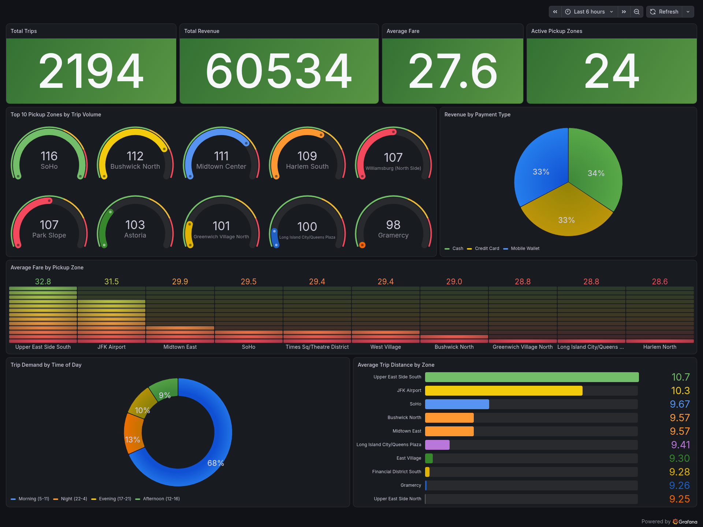

# NYC Taxi Streaming Analytics

A real-time streaming data pipeline — **Kafka → MySQL → Grafana** — that
ingests NYC taxi trip events and visualizes live fleet operations metrics:
demand by zone, revenue, fares, and time-of-day patterns.

## View the live dashboard

**[View the dashboard](https://sturdybeet2492.grafana.net/public-dashboards/2c53f422c7fb4652a2dc258c5dd6add9)**

This dashboard is backed by a real cloud database (2,000+ trip records).
Note: the free-tier database occasionally goes idle after inactivity — if
the dashboard loads blank on first click, please wait 30-60 seconds and
refresh; it reconnects automatically. For a guaranteed-instant live demo,
happy to walk through the pipeline in real time on a call.

*For live demos*, the full pipeline (Kafka to consumer to MySQL to Grafana,
refreshing every 5 seconds) also runs locally and can be tunneled to a
public URL on request — ask for a live link to watch new events stream in
in real time.



## The problem this solves

Dispatch managers need to see demand as it happens, not in yesterday's
report. This pipeline simulates that: a fleet manager watching live pickup
demand by zone can reposition idle vehicles the moment demand starts
climbing in an area, say, a business district clearing out at 6 PM,
instead of finding out the next morning that a zone was under-served, after
riders already gave up and booked a competitor. The dashboard turns a
same-day miss into a same-minute save.

## What it does

- Streams NYC-taxi-style trip events (pickup/dropoff zone, fare, distance,
  payment type, timestamps) through Apache Kafka in real time
- A Python consumer writes every trip into MySQL as it arrives
- Grafana reads live from MySQL and renders 9 panels: total revenue,
  trip volume, top-demand zones, payment mix, fare by zone, and
  time-of-day demand patterns

## Architecture

Local / live-demo pipeline:

trip_data.csv -> trip_producer.py -> Kafka (topic: trips) -> consumer.py -> MySQL -> Grafana
(Faker-generated, real NYC TLC schema) -> (Python/kafka-python) -> (mysql-connector) -> (9 live panels, refresh: 5s)

Always-on public dashboard:

Local pipeline -> migrate_to_cloud.py -> Aiven MySQL (cloud) -> Grafana Cloud (public link)

The same trip data is mirrored to a free-tier cloud MySQL instance (Aiven),
which a separate Grafana Cloud dashboard reads from directly. This is the
link above, and it stays up independent of whether the local pipeline is
running.

## Dashboard panels

| Panel | Type | Insight |
|---|---|---|
| Total Revenue | Stat | Headline KPI |
| Total Trips | Stat | Headline KPI |
| Average Fare | Stat | Headline KPI |
| Active Pickup Zones | Stat | Headline KPI |
| Top 10 Pickup Zones by Trip Volume | Bar chart | Where demand concentrates |
| Revenue by Payment Type | Pie chart | Payment mix |
| Average Fare by Pickup Zone | Gauge | Most/least profitable zones |
| Trip Demand by Time of Day | Pie chart | Morning/afternoon/evening/night demand split |
| Average Trip Distance by Zone | Bar gauge | Short-haul vs. long-haul zones |

## Run it yourself

Requirements: Docker and Docker Compose.

```bash
git clone <this-repo-url>
cd <repo-folder>

# 1. Start the full stack (Kafka, Zookeeper, MySQL, Grafana)
docker-compose up -d

# 2. Set up a Python environment and install dependencies
python3 -m venv venv
source venv/bin/activate
pip install kafka-python mysql-connector-python faker

# 3. Generate sample trip data
python generate_data.py

# 4. In one terminal, start the consumer
python consumer.py

# 5. In another terminal, start the producer
python trip_producer.py
```

Then open http://localhost:3002 (Grafana, login admin / admin). The
MySQL data source and the full "NYC Taxi Streaming Analytics" dashboard are
auto-provisioned on startup, no manual configuration needed.

## Project structure
.
├── docker-compose.yml # Kafka, Zookeeper, MySQL, Grafana - one command
├── generate_data.py # Synthetic trip data generator (Faker)
├── trip_producer.py # Kafka producer
├── consumer.py # Kafka consumer -> MySQL writer
├── migrate_to_cloud.py # One-time migration to Aiven cloud MySQL
├── db/
│ └── init.sql # Auto-creates the trips table on first run
└── grafana/
└── provisioning/
├── datasources/
│ └── mysql.yml # Auto-connects Grafana to MySQL
└── dashboards/
├── provider.yml
└── nyc-taxi-dashboard.json # The full 9-panel dashboard

## Tech stack

Python, Apache Kafka, MySQL, Grafana, Docker and Docker Compose, Aiven (cloud MySQL), Grafana Cloud

## Notes

The pipeline is fully reproducible via Docker Compose, with Grafana's
data source and dashboard auto-provisioned on startup. The data is also
mirrored to a cloud-hosted MySQL instance, powering the always-on public
dashboard above, so the project stays viewable independent of whether the
local pipeline is currently running.
